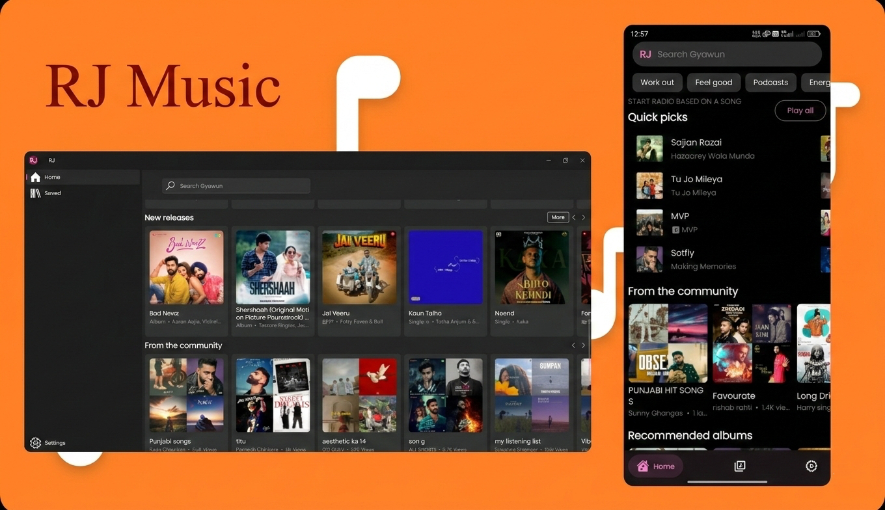

<div align="center">



# 🎵 RJ Music

**Where Music Knows No Bounds**

*Experience the freedom of unlimited, ad-free music streaming from YouTube Music*

[](https://github.com/Yaboku77/rj_music/releases/latest)
[](LICENSE)
[](https://github.com/Yaboku77/rj_music/stargazers)
[](https://github.com/Yaboku77/RJ-Music/releases)

[Download](https://github.com/Yaboku77/rj_music/releases/latest) • [Website](https://rj-music-five.vercel.app/)  • [Report Bug](https://github.com/Yaboku77/rj_music/issues)

---

</div>

## ✨ What Makes RJ Music Special

RJ Music isn't just another music player—it's your gateway to an uninterrupted musical journey. Built with Flutter and powered by YouTube Music's vast library, RJ Music brings you millions of songs without the noise of advertisements, subscription walls, or unnecessary restrictions.

Immerse yourself in crystal-clear audio quality, discover artists from every corner of the globe, and let the rhythm carry you wherever you go. With RJ Music, music flows freely, as it should.

## 🚀 Features

### Core Experience
- 🎧 **Unlimited Streaming** - Access millions of songs from YouTube Music
- 🚫 **Ad-Free Playback** - Enjoy uninterrupted listening, always
- 🎼 **High-Quality Audio** - Adjustable audio quality to suit your preference
- 🌙 **Background Playback** - Keep the music playing while you multitask
- 💾 **Offline Downloads** - Save your favorite tracks for offline listening
- ⏰ **Sleep Timer** - Fall asleep to your favorite music with auto-stop
- 🤝 **Listening Together** - Start a Jam Session and listen with friends in real-time

### Discovery & Organization
- 🔍 **Smart Search** - Find songs, artists, and playlists effortlessly
- ❤️ **Favorites** - Build your personal collection of beloved tracks
- 📝 **Custom Playlists** - Curate and organize music your way
- 🔄 **Flexible Queue** - Reorder songs on the fly
- 📜 **Listening History** - Never lose track of what you've played
- 📝 **Lyrics** - Sing along with synchronized lyrics powered by LRCLib

### Personalization
- 🎨 **Material You** - Dynamic theming that adapts to your style
- 🌓 **Dark Mode** - Easy on the eyes, day or night
- 🎚️ **Audio Enhancement** - Built-in equalizer and loudness enhancer
- 🌍 **Multi-Language Support** - Available in multiple languages
- 🔄 **Cross-Device Sync** - Sync recommendations across devices using visitor ID
- 🎙️ **Podcast Support** - Stream your favorite podcasts alongside music

## 📱 Installation

### Android

Download the latest APK from our [releases page](https://github.com/Yaboku77/RJ-Music/releases/latest) and install it on your device.

### Building from Source

```bash
# Clone the repository
git clone https://github.com/Yaboku77/rj_music.git
cd rj_music

# This project uses FVM for Flutter version management
# Install FVM if you haven't already: https://fvm.app/docs/getting_started/installation
# The Flutter version is specified in .fvmrc

# Install the correct Flutter version
fvm install

# Use the project's Flutter version
fvm use

# Install dependencies
fvm flutter pub get

# Run the app
fvm flutter run
```

## 🎯 Roadmap

We're constantly evolving. Here's what we're working on:

- [ ] iOS Support
- [ ] Desktop Applications (Windows, macOS, Linux)
- [ ] Advanced Audio Controls
- [ ] Social Features (Share playlists, collaborative playlists)
- [ ] Import/Export Playlists
- [ ] Enhanced Podcast Features

## ⚖️ Legal

**Disclaimer:** This project and its contents are not affiliated with, funded, authorized, endorsed by, or in any way associated with YouTube, Google LLC, or any of its affiliates and subsidiaries. Any trademark, service mark, trade name, or other intellectual property rights used in this project are owned by the respective owners.

RJ Music is an open-source project created for educational and personal use. Users are responsible for ensuring their usage complies with YouTube's Terms of Service and applicable laws in their jurisdiction.

## 📄 License

This project is licensed under the GNU General Public License v3.0 - see the [LICENSE](LICENSE) file for details.

---

<div align="center">

**Made with ❤️ by the RJ Music community**

*Let the music play on*

[⬆ Back to Top](#-RJ Music)

</div>
